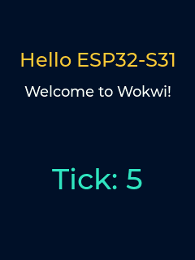

# Hello ESP32-S31 + Wokwi

A minimal ESP-IDF demo for the ESP32-S31 that drives a 240x320 ILI9341 SPI
display through `esp_lcd` and renders Montserrat text with LVGL.

The on-screen banner reads:

> Hello ESP32-S31  
> Welcome to Wokwi!  
> Tick: *N*

…where *N* increments every second.



It is set up to run in the [Wokwi](https://wokwi.com) simulator and ships a
prebuilt firmware, a Wokwi diagram, and a `wokwi-cli` scenario that takes
screenshots and asserts the boot path.

## Pin map

| ILI9341 | ESP32-S31 GPIO |
|---------|----------------|
| VCC     | 3V3            |
| GND     | GND            |
| CS      | GPIO37         |
| RST     | GPIO39         |
| D/C     | GPIO38         |
| MOSI    | GPIO35         |
| SCK     | GPIO36         |
| LED     | 3V3            |
| MISO    | - (unused)     |

SPI host is `SPI2_HOST`; clock 40 MHz; GDMA via `SPI_DMA_CH_AUTO` on the AXI
PDMA controller.

## Build

ESP-IDF master is required (S31 has not reached a tagged release yet). From the
project root:

```bash
. $IDF_PATH/export.sh        # use your ESP-IDF master worktree
idf.py --preview set-target esp32s31
idf.py --preview build
idf.py --preview uf2         # produces build/uf2.bin for Wokwi
```

`--preview` is required while S31 sits behind IDF's preview-target gate.

## Run in the Wokwi simulator

[**Run online (no install)**](https://wokwi.com/experimental/viewer?diagram=https://raw.githubusercontent.com/wokwi/esp32-s31-hello-wokwi-idf/main/diagram.json&firmware=https://raw.githubusercontent.com/wokwi/esp32-s31-hello-wokwi-idf/main/build/uf2.bin)
- launches the prebuilt `build/uf2.bin` against `diagram.json` directly in the
Wokwi viewer.

Locally with [wokwi-cli](https://docs.wokwi.com/wokwi-ci/cli-installation):

```bash
export WOKWI_CLI_TOKEN=<your-token>
wokwi-cli --scenario test.yaml --timeout 30000
```

The scenario waits for the boot banner on serial, captures `screenshots/boot.png`,
waits for the counter to reach `Tick: 5`, and captures `screenshots/tick-5.png`.

## CI

`.github/workflows/wokwi.yml` is one job that does it all on every push:
[`espressif/esp-idf-ci-action`](https://github.com/espressif/esp-idf-ci-action)
builds the firmware, [`wokwi/wokwi-ci-server-action`](https://github.com/wokwi/wokwi-ci-server-action)
spins up a local Wokwi CI server on the runner, and
[`wokwi/wokwi-ci-action`](https://github.com/wokwi/wokwi-ci-action) runs
`test.yaml` against it. Firmware and screenshot artefacts are both uploaded.
Set the `WOKWI_CLI_TOKEN` repository secret to enable the Wokwi step.

## Components

- [`espressif/esp_lcd_ili9341`](https://components.espressif.com/components/espressif/esp_lcd_ili9341) - ILI9341 panel driver, plugs into `esp_lcd`.
- [`espressif/esp_lvgl_port`](https://components.espressif.com/components/espressif/esp_lvgl_port) - LVGL display task + flush callback wiring.
- [`lvgl/lvgl`](https://components.espressif.com/components/lvgl/lvgl) - Montserrat fonts and label widgets.

## Source

```
.
├── CMakeLists.txt
├── sdkconfig.defaults     # CONFIG_IDF_TARGET, LVGL color depth, Montserrat sizes
├── diagram.json           # Wokwi diagram: S31 coreboard + ILI9341
├── wokwi.toml             # Points wokwi-cli at build/ artefacts
├── test.yaml              # Scenario: wait + screenshot at boot and Tick: 5
├── main/
│   ├── CMakeLists.txt
│   ├── idf_component.yml  # esp_lcd_ili9341, esp_lvgl_port, lvgl
│   └── main.c             # SPI bus init, ILI9341 panel, LVGL labels + tick
├── screenshots/           # Generated by test.yaml
└── .github/workflows/     # Build + Wokwi CI
```

## License

MIT for the project sources. LVGL and esp_lcd_ili9341 ship under their
respective MIT / Apache-2.0 licences and are pulled in via the IDF component
manager.
